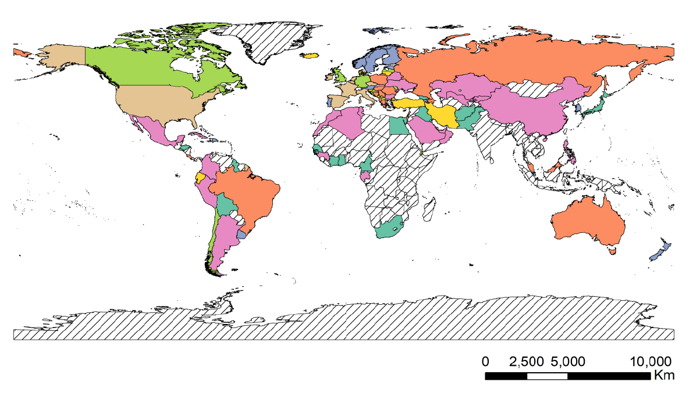

# Regions clustering based on early transmission features of Covid-19

<div align="center">Code used for our paper "**Forecasting Covid-19 Dynamics in Brazil: A DataDriven Approach**":
<https://www.mdpi.com/1660-4601/17/14/5115></div>

<br>


### Data sources
##### Covid data
- World & USA: <https://github.com/CSSEGISandData/COVID-19/>
- Brazil: <https://covid.saude.gov.br/>
- Italy: https://github.com/pcm-dpc/COVID-19

##### Population data
- China: <https://en.wikipedia.org/wiki/List_of_Chinese_administrative_divisions_by_population>
- Brazil: <https://en.wikipedia.org/wiki/List_of_Brazilian_states_by_population>
- Australia: <https://en.wikipedia.org/wiki/States_and_territories_of_Australia>
- Canada: <https://en.wikipedia.org/wiki/Population_of_Canada_by_province_and_territory>

**Note:** *All data files present in this github directory were saved on May 1st 2020, feel free to download updated versions with more recent data for new studies.*

### Citing
If you find this work useful in your research, please consider citing

```
@article{pereira2020forecasting,
title={Forecasting Covid-19 dynamics in Brazil: a data driven approach},
author={Pereira, Igor G and Guerin, Joris M and Junior, Andouglas G Silva and Distante, Cosimo and Garcia, Gabriel S and Goncalves, Luiz MG},
journal={arXiv preprint arXiv:2005.09475},
year={2020}
}
```

# DataBlender API for comments analysis

## Preliminary
###### Install *conda*
* Download the latest linux installer for miniconda at https://docs.conda.io/en/latest/miniconda.html. (python 3.7, 64-bits)
* In a terminal:
```
cd path/to/installer/Miniconda3-latest-Linux-x86_64.sh
chmod +x Miniconda3-latest-Linux-x86_64.sh
./Miniconda3-latest-Linux-x86_64.sh
```
*Note: replace file name to appropriate if using 32-bits system.*

###### Install *git*
```
sudo apt-get install git
```
## Install API
* Clone this repo:
```
git clone https://github.com/jahrardblender/analysecomment2
```
* Create and prepare conda environment:
```
conda env create -f environment.yml
```
* Download and unzip the French Sentiment Analysis model (https://drive.google.com/file/d/1q2wSuv45_npmcrHTQo2fNyIhb4qsHNIy/view?usp=sharing). It should be placed in a folder *pretrained_models*, where you will use the API.

## Sentence classification using comparison with list of topic related words

A demo can be seen by running demo_classif.py. It should be relatively self explanatory.

Be sure to have *ETUDE-25-06-20.xlsx* and *datablender_comments.sql* in a "Data/" directory in your folder to run the demo. These files can be found in teams.

## Sentiment Analysis for french comments

A demo can be seen by running demo_sentiment.py. It should be relatively self explanatory.
